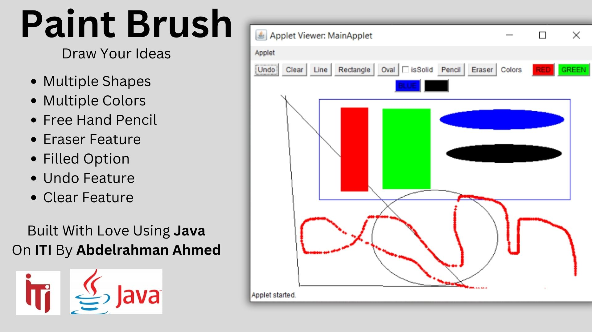

# PaintBrush
My Own version of Microsoft Paint Brush Application. made using Java and Applets to display the UI

# Introduction
during the **ITI** journey while learning **java** we had a task to create our own version of the Famous application **Microsoft Paint Brush**. this project is my version.

# Features
the app has many features that makes it reliable to use as your first choice.

- Multiple Shapes
    - Rectangle
    - Line
    - Oval (circle or Oval)
- Multiple Colors
    - Black (default color)
    - Red
    - Green
    - Blue
- Free Hand pencil
- Eraser 
- Undo Operation
- Clear Screen

# How To run and Use
1. clone the project into your computer
2. you have to have JKD 8 to use Applet to display the UI
3. run this command on CMD `appletviewer index.html`
4. enjoy😊

## Development Environment
this application was developed using **Intellij idea** on **JDK 8** to use Applet.

